# System visualization

This document is the architecture source of truth for the implemented system.
The first diagram intentionally shows only module interactions. Each following
diagram opens one module and shows its internal flow. Planned features must not
be drawn as current behavior.

## Module interaction overview

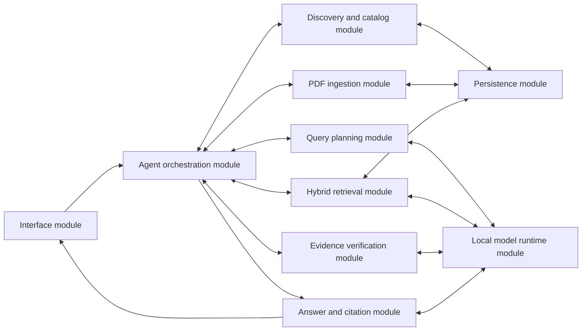

## 1. Interface module

Implementation: `app/cli.py`, `ui/gradio_app.py`.

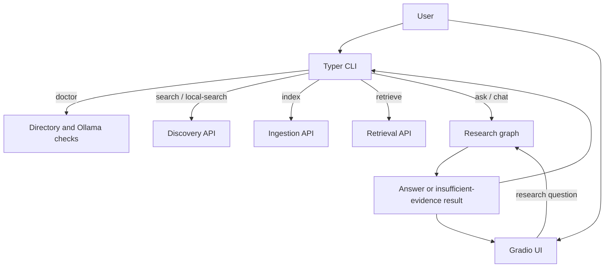

## 2. Agent orchestration module

Implementation: `app/agent/graph.py`, `app/agent/state.py`.

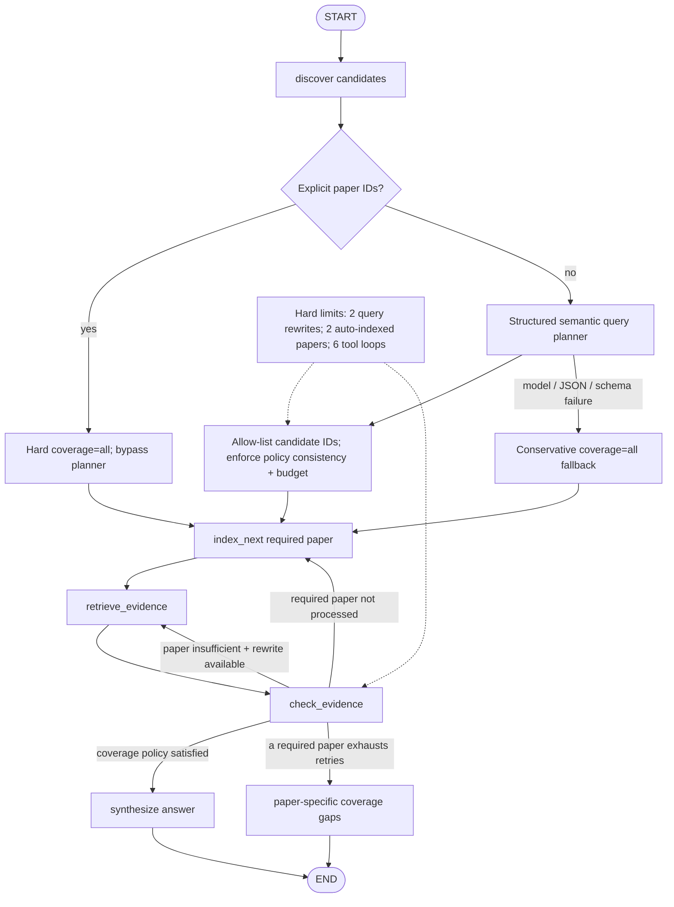

The state carries the original question, structured query plan, planner status/error/warnings,
coverage mode, required paper IDs, selected/failed papers, and per-paper maps for retrieval
queries, accumulated chunks, verifier results, and attempt counters. Semantic intent is
probabilistic; candidate allow-lists, budgets, coverage invariants, retries, and routing remain
deterministic harness responsibilities.

## 3. Discovery and catalog module

Implementation: `app/tools/arxiv_search.py`, `app/db/database.py`.

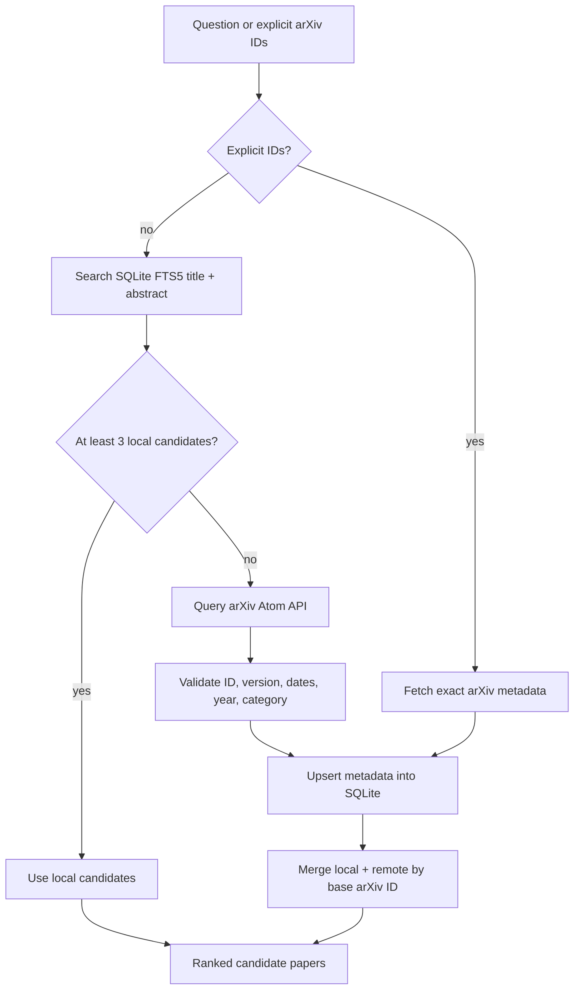

The catalog preserves base ID, versioned ID, version number, first-submitted
time, last-revised time, DOI, journal reference, categories, abstract, and PDF
URL. Journal publication date is not inferred from arXiv dates.

## 4. Query planning module

Implementation: `app/models/planner.py`, `app/agent/graph.py`.

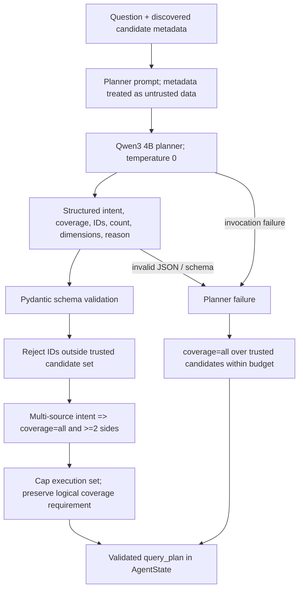

Explicit user-supplied paper IDs bypass this model completely and remain hard constraints.
Planner outputs are proposals, not authority: Python owns the candidate allow-list, automatic
indexing budget, cross-field consistency rules, and conservative failure policy. If the logical
requirement exceeds the automatic execution budget, the harness preserves that larger requirement
so aggregate coverage fails closed instead of pretending the truncated execution set is complete.
The planner's extracted dimensions are retained for tracing and future evaluation; the evidence verifier still
checks the original user question so an incorrect planner dimension cannot silently strengthen it.

## 5. PDF ingestion module

Implementation: `app/tools/paper_download.py`, `app/ingestion/pdf_parser.py`,
`app/ingestion/chunking.py`, `app/ingestion/indexing.py`.

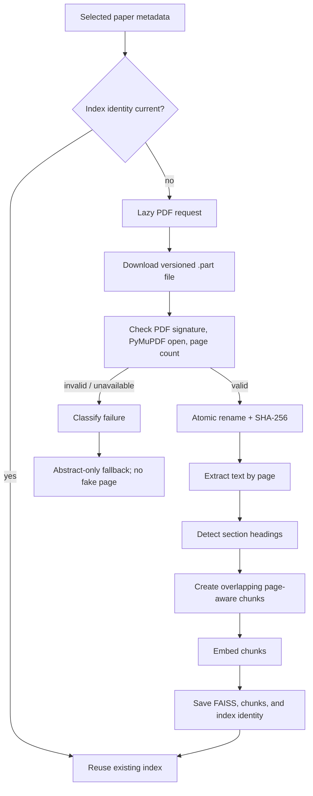

An index is reusable only when arXiv revision, exact PDF SHA-256, and embedding
model all match. A revision change invalidates stale PDF/index metadata.

## 6. Hybrid retrieval module

Implementation: `app/retrieval/vector_store.py`.

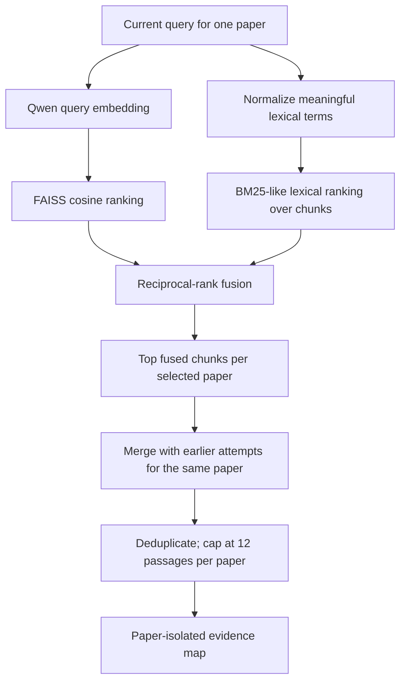

`score` remains the dense normalized-dot-product score for inspection;
`retrieval_score` controls fused ordering and is accompanied by dense and
lexical ranks.

## 7. Evidence verification module

Implementation: `app/models/verifier.py`, `app/agent/graph.py`.

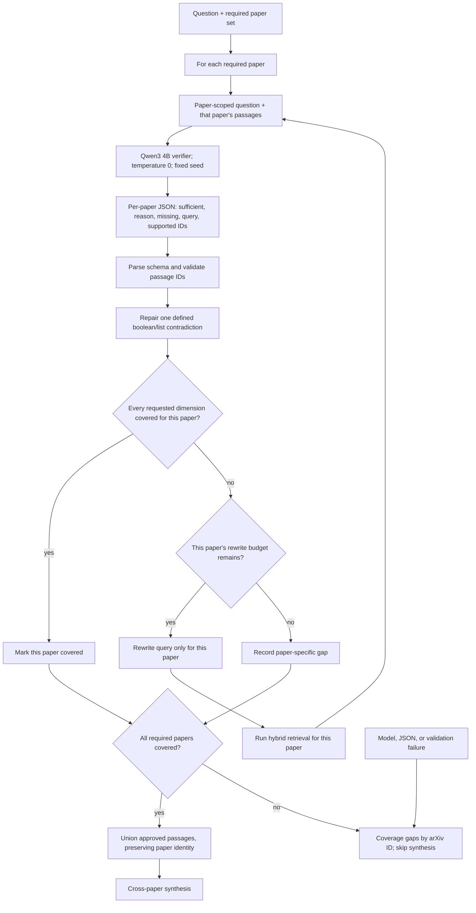

Semantic similarity is treated only as retrieval evidence, never as proof that
a passage answers the question. Negative and exhaustive questions require
enough scope; silence in a few passages is not accepted as proof. For a
multi-paper question, each paper must cover every requested comparison
dimension on its own side. Missing evidence about another paper is ignored
during that paper's check, but missing dimensions within the paper are not.

## 8. Answer and citation module

Implementation: `app/models/llm.py`.

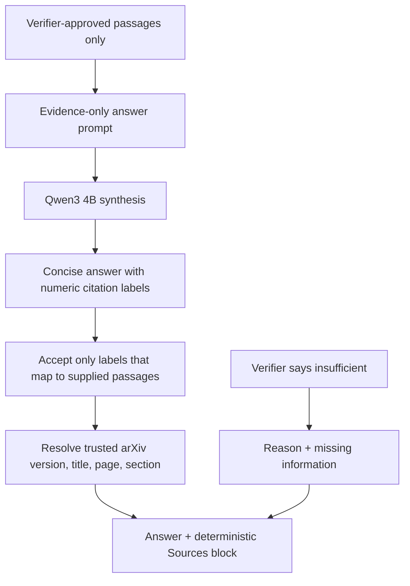

The model never authors bibliographic metadata. Abstract fallback citations are
labeled `Abstract`; full-text citations use stored page and section metadata.

## 9. Persistence module

Implementation: `app/db/database.py`, runtime files under `data/`.

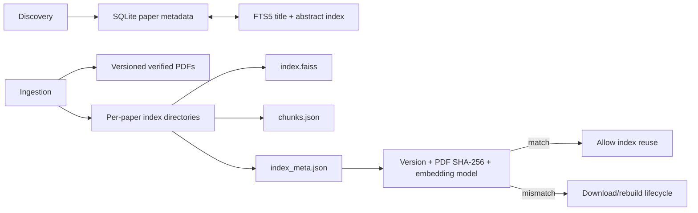

All runtime databases, PDFs, indexes, evaluation outputs, credentials, and
handoff memory are ignored by Git.

## 10. Local model runtime module

Implementation: `app/config.py`, `app/models/llm.py`, `app/models/planner.py`,
`app/retrieval/vector_store.py`.

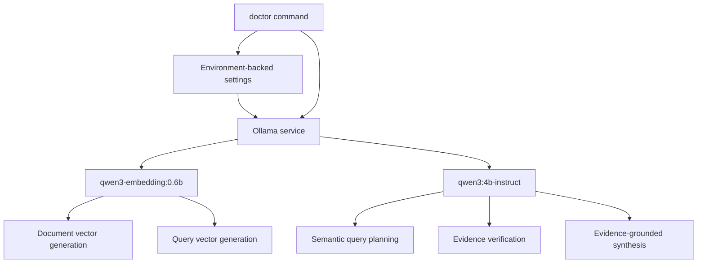

The laptop remains the local smoke-test runtime. Kaggle GPU is the preferred
future execution environment for parallel batch evaluations and model-size
comparisons when its Control Plane connection is available.

## Maintenance rule

Every architecture-changing commit must update the overview if module-level
edges changed and the matching detailed diagram if internal flow changed. The
current implementation status and next priorities live in `PROJECT_STATE.md`;
decisions, failures, and evaluation evidence remain chronological in
`DEVELOPMENT_LOG.md`. `AGENTS.md` enforces this checklist for future sessions.
