# System visualization

This document is the architecture source of truth for the implemented system.
The first diagram intentionally shows only module interactions. Each following
diagram opens one module and shows its internal flow. Planned features must not
be drawn as current behavior.

## Module interaction overview

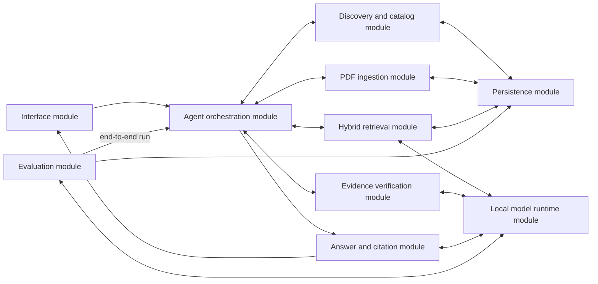

## 1. Interface module

Implementation: `app/cli.py`, `ui/gradio_app.py`.

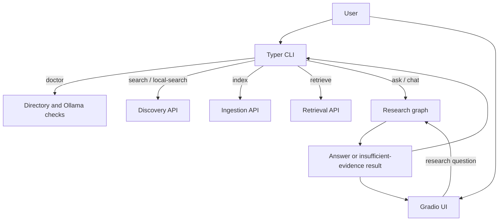

## 2. Agent orchestration module

Implementation: `app/agent/graph.py`, `app/agent/state.py`.

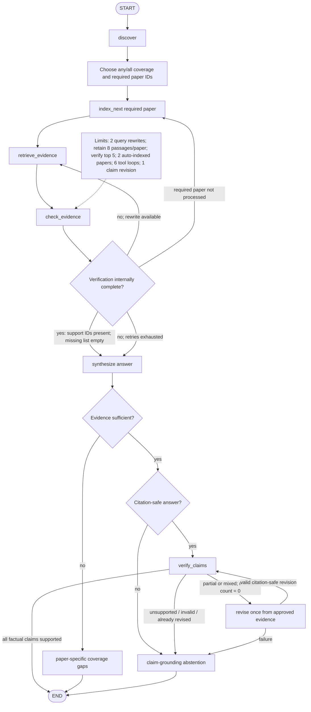

The state carries the original question, coverage mode, required paper IDs,
selected/failed papers, and per-paper maps for retrieval queries, accumulated
chunks, verifier results, and attempt counters. It also preserves approved
evidence, citation validity, the structured claim bundle, claim-verifier calls,
one revision count/history, and fail-closed errors. Aggregate fields remain for
CLI trace and final routing.

## 3. Discovery and catalog module

Implementation: `app/tools/arxiv_search.py`, `app/db/database.py`.

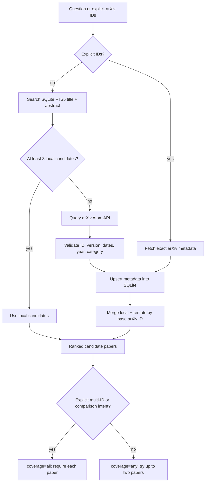

The catalog preserves base ID, versioned ID, version number, first-submitted
time, last-revised time, DOI, journal reference, categories, abstract, and PDF
URL. Journal publication date is not inferred from arXiv dates.

## 4. PDF ingestion module

Implementation: `app/tools/paper_download.py`, `app/ingestion/pdf_parser.py`,
`app/ingestion/chunking.py`, `app/ingestion/indexing.py`.

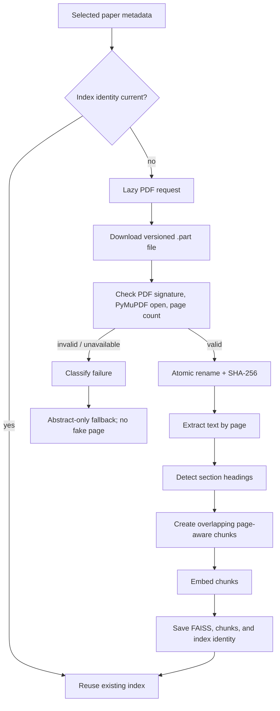

An index is reusable only when arXiv revision, exact PDF SHA-256, and embedding
model all match. A revision change invalidates stale PDF/index metadata.

## 5. Hybrid retrieval module

Implementation: `app/retrieval/vector_store.py`.

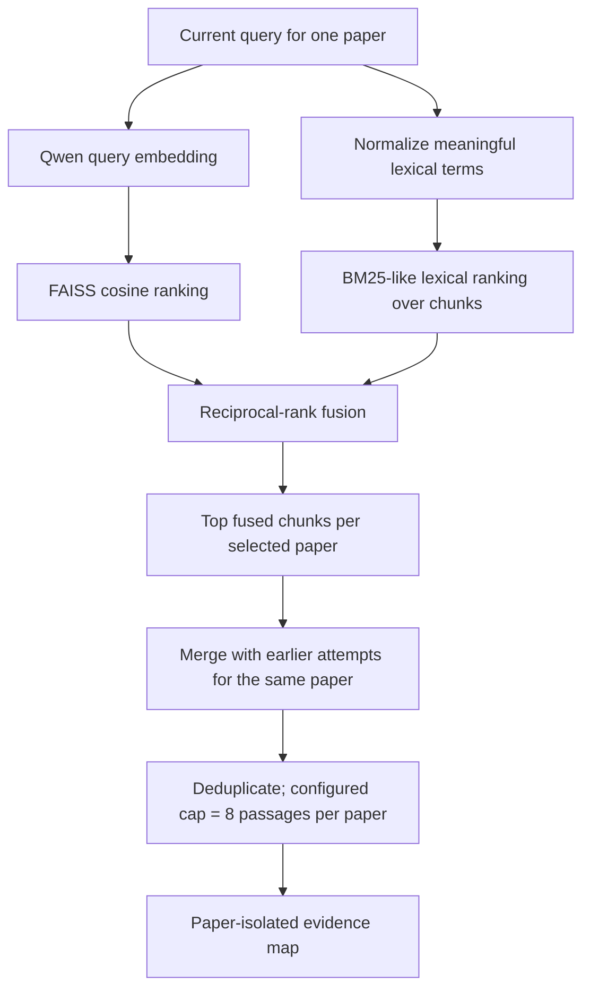

`score` remains the dense normalized-dot-product score for inspection;
`retrieval_score` controls fused ordering and is accompanied by dense and
lexical ranks.

## 6. Evidence verification module

Implementation: `app/models/verifier.py`, `app/agent/graph.py`.

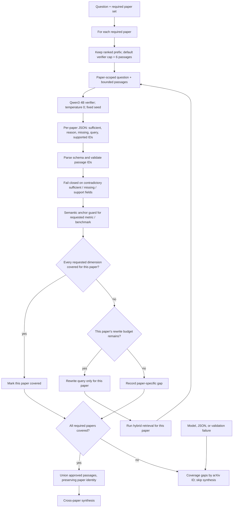

Semantic similarity is treated only as retrieval evidence, never as proof that
a passage answers the question. Negative and exhaustive questions require
enough scope; silence in a few passages is not accepted as proof. For a
multi-paper question, each paper must cover every requested comparison
dimension on its own side. Missing evidence about another paper is ignored
during that paper's check, but missing dimensions within the paper are not.
The post-parse completeness invariant is deterministic: a paper is covered only
when `sufficient=true`, at least one valid supporting passage is selected, and
`missing_information` is empty. A false decision is never upgraded merely
because it selected passages, since partial support commonly does that. The
synthesis node recomputes the same invariant before invoking its model, so stale
or contradictory graph state also abstains. The semantic guard remains
fail-closed for explicitly registered high-risk anchors: electrical-energy questions need an energy/power
measurement anchor, and ImageNet/top-1 questions need those benchmark/metric
anchors in a verifier-selected passage. A question explicitly requesting a
numerical inference-latency reduction factor also needs a verifier-selected
passage that directly links the latency reduction to a number; categorical
"no additional latency" language and numbers for other metrics cannot satisfy
it. This guard narrows a positive model decision; it never upgrades insufficient
evidence.

Retrieval state retains up to eight passages per paper across rewrites, while a
separate default cap of six limits each verifier prompt. Because the verifier
receives a prefix rather than a reordered sample, its one-based supporting IDs
remain valid against the retained per-paper list used by synthesis.

## 7. Answer and citation module

Implementation: `app/models/llm.py`, `app/models/claims.py`,
`app/models/claim_verifier.py`.

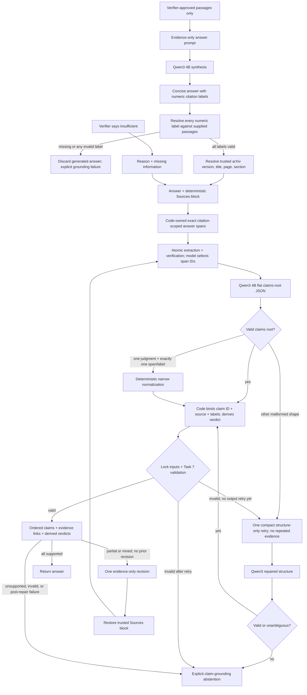

The model never authors bibliographic metadata. Abstract fallback citations are
labeled `Abstract`; full-text citations use stored page and section metadata.
Code never invents a citation when the model omits one. Missing citations and
labels outside the verifier-approved passage list fail closed before any Sources
block is rendered. The production graph then strips that deterministic block,
checks atomic claims against only approved passages, and permits at most one
answer repair. Production claim extraction cannot author claim IDs, source text,
visible labels, or verdicts: it selects a code-owned exact span and returns
ordered semantic relationships, then code reconstructs those redundant fields.
The model sees one flat `claims`-root template rather than a nested schema with
competing object definitions. If it nevertheless returns a standalone evidence
judgment, code can normalize it only when exactly one source span and one visible
citation make the binding unambiguous. The report records successful structure
repair and narrow normalization separately; multi-span or multi-label ambiguity
continues to fail closed.
Separately, one malformed response may receive one compact
structure-only retry against immutable spans; a second invalid response abstains.
The answer-repair model cannot author source metadata; code restores
it from trusted passage records before re-verification. Wholly unsupported
answers and unresolved post-repair claims also abstain.

## 8. Persistence module

Implementation: `app/db/database.py`, runtime files under `data/`.

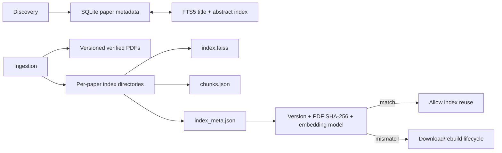

All runtime databases, PDFs, indexes, evaluation outputs, credentials, and
handoff memory are ignored by Git.

## 9. Local model runtime module

Implementation: `app/config.py`, `app/models/llm.py`,
`app/retrieval/vector_store.py`.

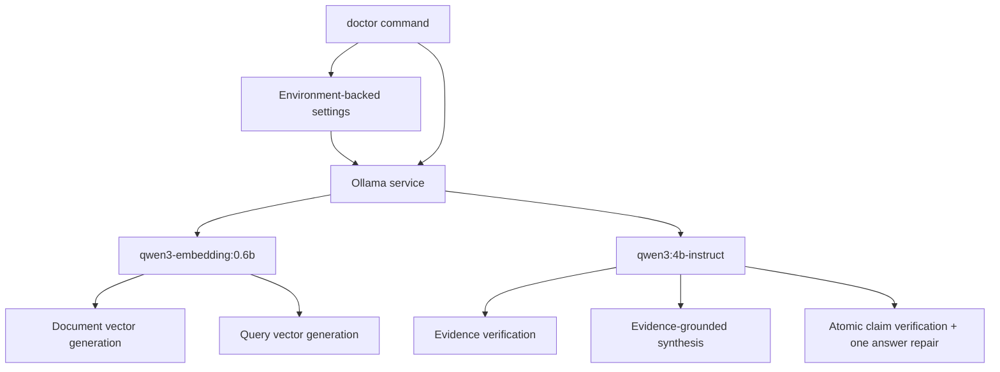

The laptop remains the local smoke-test runtime. Kaggle GPU is the preferred
future execution environment for parallel batch evaluations and model-size
comparisons when its Control Plane connection is available.

## 10. Evaluation data artifacts

Implementation: `evaluation/schema/evaluation-suite.schema.json`,
`evaluation/schema/claim-verification.schema.json`,
`evaluation/suites/v0_5/schema_fixtures.json`,
`evaluation/suites/v0_5/development_10.json`,
`evaluation/suites/v0_5/development_25.json`, `app/evaluation/`,
`app/models/claims.py`, `scripts/download_external_benchmarks.py`,
`evaluation/README.md`.

```mermaid
flowchart TD
    SCHEMA["Committed JSON Schema 1.1.0"] --> LOADER["Pydantic loader + semantic cross-reference validation"]
    LOADER --> CASES["Versioned internal evaluation cases"]
    CASES --> PAPERS["Exact arXiv revisions + required-paper set"]
    CASES --> EXPECTED["Answer/abstain decision + atomic criteria"]
    CASES --> GOLD["Gold evidence groups"]
    CASES --> PROVENANCE["Fixture/development/test + provenance + annotation"]
    CASES --> R10["Immutable reviewed 10-case R10 slice"]
    R10 --> R25["Separate 25-case suite: same first 10 + 15 new cases"]
    R25 --> NEWSOURCES["ResNet v1 + LoRA v2 + RAG v4"]
    R25 --> SOURCEMANIFEST["Five checksum-pinned PDFs + page counts"]
    GOLD --> ANCHOR["Versioned ID + source type + page + exact quote"]
    GOLD --> OPTIONAL["Optional chunk index; never sole identity"]

    RANKED["Ranked retrieval JSONL"] --> MATCHER["Revision-safe normalized quote matcher"]
    GOLD --> MATCHER
    MATCHER --> CASEMETRICS["Per-case group recall / precision / RR + diagnostics"]
    CASEMETRICS --> INTERNALMETRICS["Eligible-case aggregate + paper coverage"]
    INTERNALMETRICS --> INTERNALOUTPUTS["Ignored metrics JSON + per-case JSONL"]
    CASES --> ABLATION["Gold-hidden BM25 / Qwen dense candidate runs"]
    PAPERS --> ABLATION
    ABLATION --> FUSION["RRF or min-max CombSUM"]
    ABLATION --> RERANK["Pinned cross-encoder over lexical/dense union"]
    RERANK --> WINDOWS["900-char overlapping passage scores"]
    WINDOWS --> MAXPOOL["Max-pool passage score back to chunk"]
    FUSION --> GLOBAL["Global fixed-K ranking"]
    FUSION --> PERPAPER["Per-paper rank reset + fair fixed-K quota"]
    GLOBAL --> RANKED
    PERPAPER --> RANKED
    MAXPOOL --> GLOBAL
    MAXPOOL --> PERPAPER
    ABLATION --> ABLATIONREPORT["Ignored JSON summary + Markdown comparison"]
    R10 --> SUITEPACKAGE["Suite-selectable R10/R25 packagers"]
    R25 --> SUITEPACKAGE
    SUITEPACKAGE --> ABLATIONGPU["Pinned isolated T4 package via Control Plane"]
    ABLATION -.-> ABLATIONGPU
    ABLATIONGPU --> R25RETRIEVAL["R25 A1/A2: 8 retrieval arms completed"]

    CASES --> VDEFINITION["Controlled initial + recovery evidence snapshots"]
    VDEFINITION --> VPROMPT["Production verifier prompt + parser"]
    VPROMPT --> VMODEL["Pinned Qwen3-4B deterministic T4 batches"]
    VMODEL --> VINITIAL["Initial sufficiency + supported passages"]
    VINITIAL -->|"insufficient; once only"| VRECOVERY["Material rewrite + recovery snapshot"]
    VINITIAL --> VMETRICS["FP/FN + selection + flow metrics"]
    VRECOVERY --> VMETRICS
    VMETRICS --> VOUTPUTS["Ignored JSON + Markdown verifier report"]

    CLAIMSCHEMA["Task 7 atomic claim + evidence-link contract"] --> CLAIMFIXTURE["Traceable structural fixture"]
    CLAIMFIXTURE --> CLAIMBRIDGE["Validated labels + entails links to stable evidence IDs"]
    CLAIMBRIDGE --> CITEMETRICS["Precision + completeness + unsupported + invalid rates"]
    CITEMETRICS --> CITEOUTPUTS["Ignored JSON + Markdown citation report"]
    CLAIMSCHEMA --> CLAIMMODEL["Task 8 one-call extraction + verification — implemented"]
    CLAIMMODEL --> CLAIMBUNDLE2["Strict validated claim bundle"]
    CLAIMBUNDLE2 --> CLAIMBRIDGE
    CLAIMMODEL --> CLAIMBENCH["7-case synthetic development benchmark"]
    CLAIMBENCH --> CLAIMMETRICS["Schema + extraction + verdict + relationship metrics"]
    CLAIMMETRICS --> CLAIMGPU["Pinned isolated T4 package via Control Plane"]
    CLAIMMETRICS --> CLAIMOUTPUTS["Ignored JSON + Markdown report"]
    CLAIMMODEL --> CLAIMSPAN["Production code-owned citation-scope binding"]
    CLAIMSPAN --> CLAIMFORMAT["Production-only compact structure repair"]
    CLAIMFORMAT --> CLAIMGRAPH["Task 10 bounded verify / repair / abstain graph"]
    CASES --> E2E["Task 11 end-to-end graph runner"]
    CLAIMGRAPH --> E2E
    E2E --> NODETRACE["Ordered LangGraph node updates + final state"]
    NODETRACE --> E2EMETRICS["Registered decision / retrieval / claim / latency metrics"]
    E2EMETRICS --> E2EOUTPUTS["Ignored full/aggregate JSON + per-case JSONL + Markdown"]
    E2E --> E2EIDENTITY["Validate owner/slug + 50-char Kaggle limits"]
    E2EIDENTITY --> E2EPACKAGE["Narrow T4 Kaggle package; dual-GPU or CPU-embedding fallback"]
    E2EPACKAGE --> GPUMEM["Per-call GC/cache cleanup + CUDA peak/post-call telemetry"]
    GPUMEM --> E2ESMOKE
    E2ESMOKE["1-case production-graph smoke gate"]
    E2ESMOKE --> E2ER10["10-case live development baseline"]
    E2ER10 --> E2EOUTPUTS
    R25 --> E2ER25["R25 paired E2E: production RRF vs opt-in reranker"]
    E2ER25 --> E2ERRF["R12 RRF: 0.92 decision accuracy"]
    E2ER25 --> E2ERERANK["R13 rerank: higher retrieval, 0.84 decision accuracy"]
    E2ERRF --> E2ER23["R23 RRF runtime: 25/25; zero OOM/tool/execution errors"]
    E2ER23 --> E2EOUTPUTS
    E2ERERANK --> E2EOUTPUTS
    E2EBASELINE["Prior exact-suite metrics.json"] --> E2ECOMPARE["Directional deltas; no threshold"]
    E2EMETRICS --> E2ECOMPARE
    E2ECOMPARE --> E2EOUTPUTS

    SUITEPACKAGE --> JUDGEPROMPT["Case-local advisory judge prompt"]
    JUDGEPROMPT --> JUDGEMODEL["Batched deterministic Qwen on isolated T4"]
    JUDGEMODEL --> JUDGEENV["Kaggle PyTorch inherited; Pydantic/core pinned"]
    JUDGEMODEL --> JUDGEJSON["Validated verdict + five scores + findings"]
    JUDGEJSON --> HUMAN["Human review still required; publication state unchanged"]

    DOWNLOAD["Checksum-pinned public downloader"] --> QASPER["Native QASPER v0.3 adapter"]
    DOWNLOAD --> SCIFACT["Native SciFact adapter"]
    QASPER --> RUNNER["Portable lexical / dense / hybrid runner"]
    RUNNER --> GUARD["Gold-hidden prediction + explicit test access gate"]
    GUARD --> GENERATOR["No-model smoke or Transformers generation"]
    GENERATOR --> BATCH["Batched pipeline inference + bounded OOM batch fallback"]
    BATCH --> METRICS["Official-style answer/evidence F1 + Recall@K/MRR"]
    SCIFACT --> SDOCS["Supplied cited abstracts — oracle-document mode"]
    SDOCS --> SMODEL["Pinned Qwen3-4B native 3-way classifier"]
    SMODEL --> METRICS2["Label macro F1 + rationale + joint metrics"]
    METRICS2 --> SPACKAGE["Isolated T4 package + ignored report"]
    DOWNLOAD --> RUNTIME["Ignored data/evaluations/external/"]

    RUNNER --> OUTPUTS["Ignored predictions JSONL + metrics JSON"]
    RUNNER --> PACKAGE["Narrow dev-only Kaggle source package + checksums"]
    PACKAGE --> VENV["Clean Kaggle venv + pinned direct requirements"]
    VENV --> PREFLIGHT["T4 identity + CUDA matmul + dependency fingerprint"]
    PREFLIGHT -.-> KAGGLE["Heavy dense/model batch via Kaggle Control Plane"]
    PREFLIGHT --> OUTPUTS
    R11["Archived QASPER R11 source snapshot"] --> R11ENV["Embedded app + pinned isolated T4 runtime"]
    R11ENV --> R11RUN["Lexical / dense / hybrid + generation"]
    R11RUN --> R11RESULT["Recorded dev metrics; runtime outputs not committed"]
    SPACKAGE --> OUTPUTS
```

Committed suites are source artifacts, while generated model responses, metric
reports, and baselines are runtime artifacts and remain outside version control.
The LLM judge is an annotation-lint branch: it reads committed development cases
and writes a separate ignored report, but has no edge back into annotation or
freeze state. Abstention cases always retain a human-review flag because selected
context cannot prove document-wide absence.
Negative cases have no retrieval denominator; their retrieval metrics are not
applicable and they are evaluated later through verifier/abstention behavior.
Internal retrieval scoring is isolated from retriever execution. Matching first
requires the pinned `versioned_id`, then normalized quote containment or the
documented token-recall threshold; page equality alone never creates a match.
Evidence-group, item, and required-paper coverage remain distinct so one passage
cannot hide a missing paper in a comparison case.
The internal ablation branch creates one checksum-validated chunk corpus and
holds it fixed across BM25 and pinned Qwen3 dense retrieval. It compares the
production-equivalent global RRF path with min-max CombSUM and diagnostic
per-paper rank/quota variants, always under one total K. Per-paper diagnostics
approximate the production graph's paper isolation but do not reproduce its
sequential verifier loop. They remain evaluation branches and cannot silently
change the production retriever.
The controlled verifier branch resolves committed evidence IDs to exact gold
quotes and uses the production prompt/parser without invoking retrieval or
synthesis. Its recovery edge is bounded to one execution, and initial decision,
passage-selection, recovery, abstention, parsing, latency, and call-count metrics
remain separate. The suite and outputs are development artifacts and do not
cross the publication gate.
The Task 7 claim contract preserves the exact answer substring behind each
normalized atomic claim, visible citations, evidence relationships, and a
derived verdict. Task 8 supplies the one-call extraction and verification
implementation used by Task 10's bounded production graph. Its controlled
development branch sends the same verification prompts through one pinned model,
parses every response with the production validator, and separately reports
schema validity, exact extraction, claim verdicts, evidence relationships, and
citation diagnostics. The seven synthetic cases are not a publication set.
Validated bundles adapt to the citation-safety branch through stable evidence IDs. Unknown predicted IDs are
measured, unknown gold support IDs are rejected, and empty metric denominators
remain null. The committed inputs are fixtures for contract validation rather
than model quality results.
External datasets remain in their native format, preventing repo-authored schema
adaptation from silently changing official answer, evidence, or claim labels.
The no-model mode is a retrieval smoke only and is never presented as an answer
model result. Dense encoders are cached per active paper. Generator prompts are
submitted to Transformers together and internally batched; a CUDA OOM halves
the batch down to one instead of falling back to local compute. Test-set access
is an explicit CLI decision rather than the default development path. The R11
directory is a historical, immutable source snapshot; future evaluator changes
remain in `app/evaluation/` and the packaging script rather than being made in
the archived runner.

Task 11 end-to-end reporting is a versioned observer of the compiled production
graph. The production adapter records each LangGraph node update and reconstructs
the final state; per-case traces therefore retain new nodes and fields. Metric
meaning remains explicit through a direction registry. Exact suite fingerprint,
ordered cases, dataset version, and config must match before baseline comparison.
Comparison is informational and has no hard-coded pass threshold. Outputs remain
ignored JSONL/JSON/Markdown runtime artifacts. The Kaggle adapter keeps the
compiled graph and swaps only the Ollama transports: deterministic Qwen3-4B FP16
runs on T4 device 0 while the pinned SentenceTransformer runs on device 1 when
available, otherwise on CPU. Each generation attempt performs host garbage
collection and CUDA-cache release before and after the call, including the OOM
path, and records attempted/successful/OOM calls plus peak and post-call CUDA
allocation. Retrieval state may retain eight passages per paper, while evidence
verification receives only the first five ranked passages to bound prefill
memory without changing retrieval metrics. A
one-case smoke must finish without execution failure before the full ten cases
start. R4 completed this path without runtime/tool errors, but its two negative
cases were false positives and four claim-verifier outputs failed the strict
contract. R5 added semantic anchors and a one-shot structure repair: both
negative cases abstained, but none of the four malformed claim bundles recovered
and one final verifier call exhausted T4 memory. R6 added exact answer-span
binding and an eight-passage cap; the cap
removed tool errors, but model-authored top-level fields still caused three
claim failures. R7 moved those fields into code and recovered three cases,
leaving one comparison failure caused by a copied assessment citation label.
R8 confirmed zero structural claim failures after v3, then exposed a semantic
scope boundary: a factual lead sentence shared the citation placed at the end
of the following sentence. Production v4 groups uncited lead sentences with the
next cited sentence into one exact span; claims remain atomic and receive
separate relationship judgments. Production embedding-call instrumentation
remains future work. R9 validated this path on
all ten development cases with no claim-structure, citation-safety, execution,
or tool errors and no answer revisions. Retrieval Recall@5 remained `0.6667`, so
the clean graph decision checkpoint does not imply complete annotated-evidence
retrieval or held-out quality. After independent source review, R10 repeated the
R9 configuration on suite v0.1.3 and reproduced every quality metric exactly;
its ignored aggregate is the first development regression baseline. Kaggle
identity length is validated before packaging so invalid metadata fails locally.
On R25, R20/R21 separated leaked post-OOM state from a genuine single-call T4
peak. The five-passage verifier prefix and unconditional adapter cleanup passed
focused R22 and full R23; R23 completed all 25 cases and 86 physical calls with
zero OOM/tool/execution errors. Its remaining retrieval, answer-completeness,
and claim-grounding failures stay in their respective graph/report layers and
are not collapsed into the runtime-success edge.

## Maintenance rule

Every architecture-changing commit must update the overview if module-level
edges changed and the matching detailed diagram if internal flow changed. The
current implementation status and next priorities live in `PROJECT_STATE.md`;
decisions, failures, and evaluation evidence remain chronological in
`DEVELOPMENT_LOG.md`. `AGENTS.md` enforces this checklist for future sessions.
